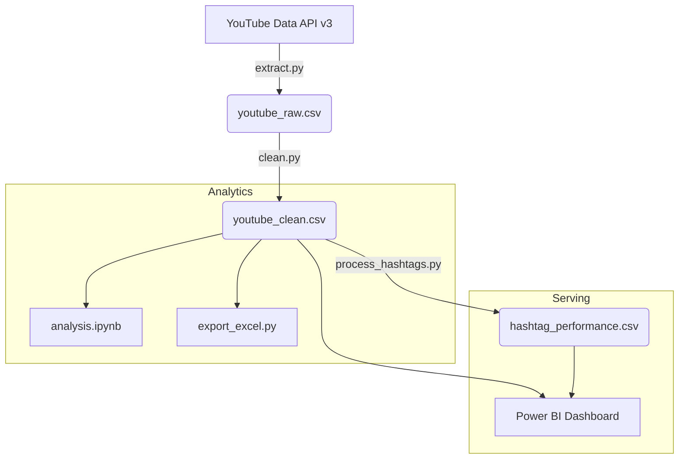

# Vietnam YouTube Trending Analytics

[](https://www.python.org)
[](https://developers.google.com/youtube/v3)
[](https://powerbi.microsoft.com)

Hệ thống end-to-end pipeline tự động kéo 200 video YouTube lọt top trending tại Việt Nam, xử lý dữ liệu, và trực quan hóa lên Power BI Dashboard nhằm giải quyết bài toán: **Điều gì thực sự giúp một video lọt vào top thịnh hành?**

---

## 🎯 Bài Toán Kinh Doanh

Các nhà sáng tạo nội dung và Marketing thường không có cách đo lường chính xác khung giờ đăng bài, định dạng nội dung hay các thẻ (tags) nào mang lại hiệu suất tốt nhất. Pipeline này cung cấp câu trả lời dựa trên dữ liệu thực tế thay vì phỏng đoán.

Trả lời 3 câu hỏi cốt lõi:
1. **Khi nào nên đăng bài** — Khung giờ và ngày nào mang lại nhiều lượt xem nhất?
2. **Định dạng thế nào** — Độ dài tiêu đề, việc sử dụng emoji hay số có ảnh hưởng đến hiệu suất không?
3. **Sử dụng hashtag gì** — Những hashtag nào thường xuyên xuất hiện ở các video có tỷ lệ tương tác cao nhất?

---

## 📊 Dữ Liệu & Feature Engineering

- **Nguồn dữ liệu**: Gọi trực tiếp từ YouTube Data API v3 (Lấy danh sách Top 200 video trending mới nhất tại khu vực `VN`).
- **Khối lượng**: 200 videos, liên tục cập nhật theo thời gian thực mỗi lần chạy pipeline.
- **Kỹ thuật đặc trưng (Feature Engineering)**: Để phục vụ phân tích sâu, dữ liệu thô đã được làm sạch và tự động tính toán thêm các trường giá trị cao:
  - `Engagement Rate`, `Like Rate`, `Comment Rate`: Đo lường tỷ lệ tương tác thực tế thay vì chỉ nhìn vào View.
  - `Publish Hour` & `Day of Week`: Chuyển đổi múi giờ UTC sang giờ Việt Nam để phân tích "khung giờ vàng".
  - `Duration Bucket`: Phân loại thời lượng video thành các nhóm (VD: 3-5 phút, 10-30 phút).
  - `Title Length`, `Has Emoji`, `Has Number`: Trích xuất đặc trưng từ tiêu đề video để tìm công thức đặt tên thu hút.
  - `Tags`: Bóc tách và tổng hợp chỉ số hiệu năng cho từng hashtag riêng biệt.

---

## ⚙️ Luồng Xử Lý (Data Pipeline)


*Dữ liệu đi từ YouTube API qua các bước làm sạch bằng Pandas, sau đó được tự động phân phối ra Báo cáo Excel tự động, Sổ tay phân tích và Power BI Dashboard.*

---

## 📈 Power BI Dashboard (Phân Tích Trực Quan)

Dashboard được thiết kế không chỉ để trưng bày số liệu, mà để trả lời trực tiếp các câu hỏi kinh doanh.

**Trang 1 — Tổng Quan & Hành Vi Người Xem**
- **Đánh giá hiệu suất tổng thể**: Theo dõi các chỉ số cốt lõi (Total Views, Avg Engagement Rate).
- **Phân tích Thời điểm đăng (Heatmap)**: Xác định khung "giờ vàng" và ngày trong tuần mang lại lượt xem cao nhất.
- **Tối ưu Thời lượng (Bar Chart & Scatter)**: Đánh giá xem nhóm thời lượng nào giữ chân người xem tốt nhất và mang lại tương tác cao.

**Trang 2 — Phân Tích Kênh & Hashtag (Content Strategy)**
- **Xác định Đối thủ & Kênh dẫn đầu**: Theo dõi Top 10 kênh có lượt view thống trị tab thịnh hành.
- **Khám phá "Từ khóa vàng" (4-Quadrant Scatter)**: Ma trận phân tích Tần suất vs Tương tác giúp phát hiện những hashtag mang lại tỷ lệ tương tác cực kỳ cao.
- **Chi tiết Hashtag**: Bảng theo dõi và đánh giá mức độ hiệu quả của từng từ khóa cụ thể.

---

## 💡 Key Findings (Kết Quả Tiêu Biểu)

*(Lưu ý: Pipeline chạy real-time nên kết quả có thể biến động, dưới đây là insight rút ra từ bản snapshot hiện tại)*
- **Khung giờ vàng**: Video đăng tải vào các khung giờ tối (18h-20h) vào các ngày cuối tuần thường có xác suất lọt top trending với lượng View áp đảo.
- **Định dạng tối ưu**: Các video có thời lượng tầm trung (**10-30 phút**) mang lại tỷ lệ tương tác (Engagement Rate) cao nhất, vượt trội hơn so với video quá ngắn (dưới 3 phút). Việc tiêu đề chứa Số liệu hoặc Emoji cũng là một mẫu số chung của các video triệu view.
- **Chiến lược Hashtag**: Những hashtag thuộc ngách giải trí/game (VD: `#lienquan`, `#hai`) có tần suất xuất hiện dày đặc nhất, nhưng những hashtag thuộc ngách giáo dục/review lại có tỷ lệ tương tác trung bình ổn định hơn. Phân tích ma trận góc phần tư (4-Quadrant) đã lọc ra được danh sách các "từ khóa vàng" đáng để chèn vào video nhất.

---

## 📂 Kiến Trúc Source Code

- **`src/utils.py`**: Các hàm tiện ích dùng chung (Parse thời gian, cấu hình log).
- **`src/extract.py`**: Gọi API và lưu dữ liệu thô.
- **`src/clean.py`**: Làm sạch dữ liệu, xử lý múi giờ và Feature Engineering.
- **`src/process_hashtags.py`**: Xử lý tách từ khóa chuyên sâu.
- **`src/export_excel.py`**: Tự động sinh báo cáo Excel.
- **`run_pipeline.py`**: File thực thi 1-chạm (One-click) cho toàn bộ chu trình.

---

## 🚀 Hướng Dẫn Cài Đặt & Vận Hành

```bash
# 1. Clone project và kích hoạt môi trường ảo (venv)
python -m venv venv
venv\Scripts\activate      # Dành cho Windows
source venv/bin/activate   # Dành cho Mac/Linux

# 2. Cài đặt thư viện
pip install -r requirements.txt

# 3. Thêm API Key
cp .env.example .env
# Mở file .env và điền → YOUTUBE_API_KEY=your_key_here
```

**Chạy toàn bộ Pipeline (Kéo data -> Làm sạch -> Xuất Excel) chỉ với 1 lệnh:**
```bash
python run_pipeline.py
```
