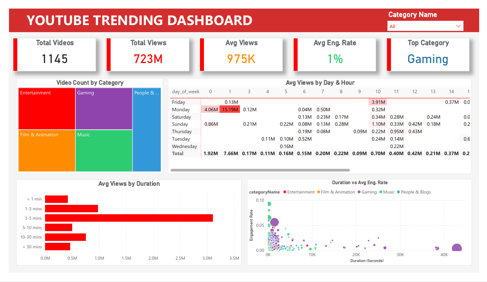
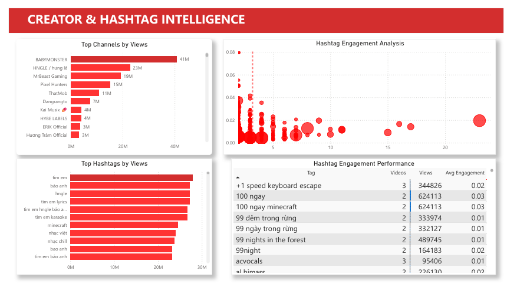

# Vietnam YouTube Trending Data Pipeline & Dashboard 📊🇻🇳

## 📌 Project Overview
An end-to-end Data Engineering & Analytics project that extracts real-time data from the **YouTube Data API (v3)** for trending videos in Vietnam, processes the raw data using **Python (Pandas)**, and visualizes the insights via a highly interactive and aesthetically pleasing **Power BI Dashboard**.

This project demonstrates the ability to build a complete ETL (Extract, Transform, Load) pipeline and deliver business intelligence insights.

## 📸 Dashboard Preview

### 1. General Overview


### 2. Creator & Hashtag Intelligence


## 🛠️ Technology Stack
- **Language**: Python 3.x
- **Libraries**: `pandas`, `google-api-python-client`, `isodate`, `python-dotenv`
- **API**: YouTube Data API v3
- **BI Tool**: Power BI Desktop
- **Version Control**: Git / GitHub

## ⚙️ Data Pipeline Architecture

1. **Extraction (`src/extract.py`)**: 
   - Connects to the YouTube API.
   - Fetches the Top 200 trending videos in the Vietnam region (`regionCode='VN'`).
   - Extracts metadata including `viewCount`, `likeCount`, `commentCount`, `duration`, and `tags`.

2. **Transformation (`src/clean.py` & `src/process_hashtags.py`)**:
   - Converts complex ISO 8601 timestamps into readable `duration_sec`.
   - Classifies videos into `duration_bucket` (e.g., "3-5 mins", "10-20 mins") for categorical analysis.
   - Computes an `Engagement Rate` metric.
   - Explodes string `tags` into a fully normalized `hashtag_performance.csv` dataset, enabling scatter plot analysis of hashtag effectiveness.

3. **Loading (`data/processed/`)**: 
   - Outputs pristine, analytical-ready CSV datasets.

4. **Visualization (`dashboard/`)**: 
   - A custom Power BI dashboard using a `youtube_theme.json` for consistent, premium UI/UX.
   - Features include custom KPI Cards, interactive Treemaps, and conditionally formatted Bar Charts.

## 🚀 How to Run Locally

1. **Clone this repository**:
   ```bash
   git clone https://github.com/Tthoong129/Youtube_Analyst.git
   cd Youtube_Analyst
   ```

2. **Set up virtual environment & install dependencies**:
   ```bash
   python -m venv venv
   source venv/Scripts/activate  # On Windows
   pip install -r requirements.txt
   ```

3. **Configure API Key**:
   - Create a `.env` file in the root directory.
   - Add your API Key: `YOUTUBE_API_KEY=your_api_key_here`

4. **Run the ETL Pipeline**:
   ```bash
   python run_pipeline.py
   ```
   *(This will fetch the latest trending data and update the CSV files).*

5. **View Dashboard**:
   - Open `dashboard/Youtube_Trending_Dashboard.pbix` in Power BI Desktop.
   - Click **Refresh** to load the newly generated local data.

## 📝 License
This project is for educational and portfolio purposes. Data is fetched using the official YouTube API.
